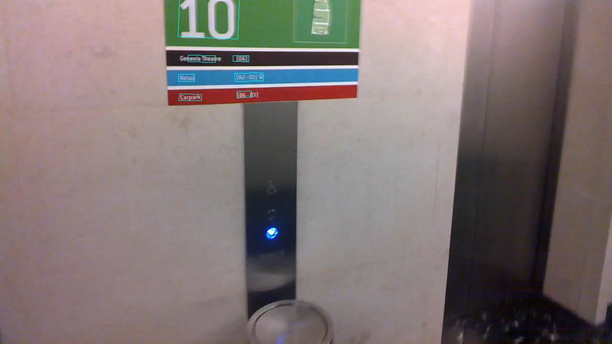

# EAST: An Efficient and Accurate Scene Text Detector

### Introduction
This is a Pytorch re-implementation of [EAST: An Efficient and Accurate Scene Text Detector](https://arxiv.org/abs/1704.03155v2).
The features are summarized blow:
+ Only **RBOX** part is implemented.
+ Incidental Scene Text Detection Challenge using only training images from ICDAR 2015 and 2013.
+ Differences from original paper
     + Use Mobilenet-v2 / ResNet-50
     + Use dice loss (optimize IoU of segmentation) rather than balanced cross entropy
     + Use linear learning rate decay rather than staged learning rate decay
+ Every parameter is written in `config.py`, you should change it before you run this project
+ The pre-trained model byprovided achieves ( Mobilenet-v2-**75.01**, ResNet-50-**81.63**) F1-score on ICDAR 2015
+ Speed on 720p (resolution of 1280x720) images:
     + Now
          + Graphic card: GTX 1080 Ti
          + Network fprop: **~50 ms**
          + NMS (Python): **~6ms**
          + Overall: **~16 fps**

Thanks for the code of authors ([@argman](https://github.com/argman)) and ([@songdejia](https://github.com/songdejia))

### Contents
1. [Installation](#installation)
2. [Download](#download)
3. [Train](#train)
4. [Test](#test)
5. [Demo](#demo)
6. [Compute-hmean](#compute-hmean)
7. [Examples](#examples)

### Installation
1. Any version of pytorch version > 0.4.1 should be ok.
2. Other library is instructed in `requirements.txt`.

### Download
1. Models trained on ICDAR 2013 (training set) + ICDAR 2015 (training set): [BaiduYun link](http://pan.baidu.com/s/1jHWDrYQ)
2. Mobilenet-v2 and Resnet V1 50  are provided by : [BaiduYun link](http://download.tensorflow.org/models/resnet_v1_50_2016_08_28.tar.gz)

### Train
If you want to train the model, you should provide the dataset path, in the dataset path, a separate gt text file should be provided for each image
and run

```
python train.py
```
If you have more than one gpu, you can pass gpu ids to gpu_list(like --gpu_list=0,1,2,3)

**Note: you should change the gt text file of icdar2015's filename to img_\*.txt instead of gt_img_\*.txt(or you can change the code in icdar.py), and some extra characters should be removed from the file.
See the examples in training_samples/**

### Test
run
```
python eval.py
```
a text file will be then written to the output path.

### Demo
If you've downloaded the pre-trained model, you can setup a demo server by
```
python3 run_demo_server.py --checkpoint-path /tmp/east_icdar2015_resnet_v1_50_rbox/
```

### Compute-hmean
run
```
python compute_hmean.py
```
a text file will be then written to the output path.


### Examples
Here are some test examples on icdar2015, enjoy the beautiful text boxes!



Please let me know if you encounter any issues(my email zhangmingliang2018@ia.ac.cn).

